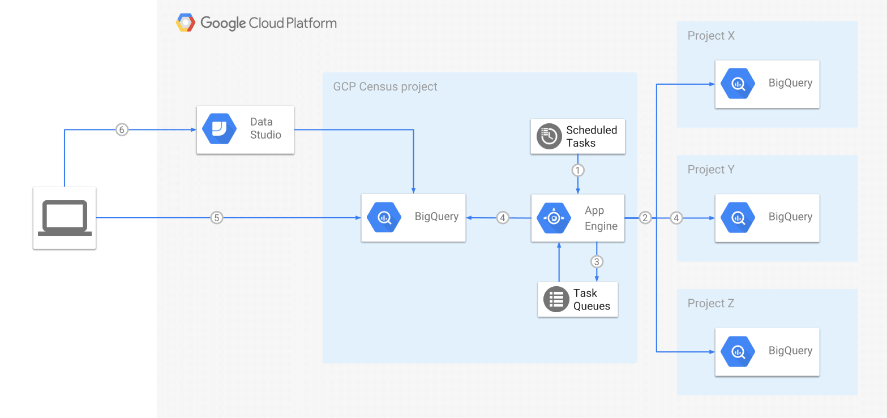

<h1>DEPRECATED</h1>
[](https://gist.github.com/cheerfulstoic/d107229326a01ff0f333a1d3476e068d)
[](https://travis-ci.org/ocadotechnology/gcp-census)
[](https://coveralls.io/github/ocadotechnology/gcp-census?branch=master)
# GCP Census
GAE python based app which regularly collects metadata about BigQuery tables and stores it in BigQuery.

GCP Census was created to answer the following questions:
* How much data we have in the whole GCP organisation?
* How many tables/partitions do we have?
* Which datasets/tables are the largest or most expensive?
* How often tables/partitions are updated over time?
* How our datasets/tables/partitions are growing over time?
* Which tables/datasets are stored in specific location?

Now every question above can be easily answered by querying metadata tables in BigQuery or looking at our dashboard created in [Google Data Studio](https://cloud.google.com/data-studio/).

## Query examples using Standard SQL dialect

* Count all data to which GCP Census has access
```sql
SELECT sum(numBytes) FROM `YOUR-PROJECT-ID.bigquery_views.table_metadata_v1_0`
```
* Count all tables and partitions
```sql
SELECT count(*) FROM `YOUR-PROJECT-ID.bigquery_views.table_metadata_v1_0`
SELECT count(*) FROM `YOUR-PROJECT-ID.bigquery_views.partition_metadata_v1_0`
```
* Select top 100 largest datasets
```sql
SELECT projectId, datasetId, sum(numBytes) as totalNumBytes 
FROM `YOUR-PROJECT-ID.bigquery_views.table_metadata_v1_0`
GROUP BY projectId, datasetId ORDER BY totalNumBytes DESC LIMIT 100
```
* Select top 100 largest tables
```sql
SELECT projectId, datasetId, tableId, numBytes 
FROM `YOUR-PROJECT-ID.bigquery_views.table_metadata_v1_0`
ORDER BY numBytes DESC LIMIT 100
```
* Select top 100 largest partitions
```sql
SELECT projectId, datasetId, tableId, partitionId, numBytes 
FROM `YOUR-PROJECT-ID.bigquery_views.partition_metadata_v1_0`
ORDER BY numBytes DESC LIMIT 100
```

* Provide cost estimation for the top 100 largest datasets
```sql
SELECT * FROM `YOUR-PROJECT-ID.bigquery_views.datasets_cost_estimation_v1_0`
ORDER BY estimatedMonthlyCostInUSD DESC LIMIT 100
```

### Dataset cost estimation

Views with costs are only estimation because:
* monthly cost is estimated based on current data (i.e. if you created large table today, estimation will show it's costs for the whole month),
* snapshots are done daily and don't include temporary tables created and deleted between snapshots,
* deduplication views summarises all data from the last 2 days (i.e. it includes table deleted yesterday),
* estimation costs doesn't include free 10 GB per month as Census doesn't know how many billing accounts are used.

## How it works?



GCP Census retrieves BigQuery metadata using [REST API](https://cloud.google.com/bigquery/docs/reference/rest/v2/):
1. Daily run is triggered by GAE cron (see [cron.yaml](config/cron.yaml) for exact details)
1. GCP Census iterates over all projects/datasets/tables to which it has access
1. A task is created for each table and queued for execution in GAE Task Queue
1. Task worker retrieves [Table metadata](https://cloud.google.com/bigquery/docs/reference/rest/v2/tables) and streams it into [bigquery.table_metadata](bq_schemas/bigquery/table_metadata_v1_0.json) table. In case of partitioned tables, GCP Census retrieves also [partitions summary](https://cloud.google.com/bigquery/docs/creating-partitioned-tables#listing_partitions_in_a_table) by querying the partitioned table and stores metadata in [bigquery.partition_metadata](bq_schemas/bigquery/partition_metadata_v1_0.json) table 
1. User can query metadata using BigQuery UI/API
1. Optionally you can create a Data Studio dashboard based on metadata

GCP Census will retrieve metadata of tables it has read access to, which means the scope is derived from GCP IAM settings.

# Build instructions

1. Create GCP project and assign billing to it
1. Clone GCP Census repository
1. Specify metadata output BigQuery location in [app.yaml](app.yaml) (defaults to 'EU')
1. Install dependencies (ideally using [virtualenv](https://virtualenv.pypa.io/en/stable/)):
    ```
    pip install -r requirements.txt
    pip install -t lib -r requirements.txt
    ```
1. Deploy to App Engine using [gcloud](https://cloud.google.com/sdk/) CLI tool:
    ```
    gcloud app deploy --project YOUR-PROJECT-ID -v v1 app.yaml config/cron.yaml config/queue.yaml 
    ```
1. Grant [bigquery.dataViewer](https://cloud.google.com/bigquery/docs/access-control#bigquery.dataViewer) role to YOUR-PROJECT-ID@appspot.gserviceaccount.com service account at GCP organisation, folder or selected projects level.
1. Enable BigQuery in the project. BigQuery is automatically enabled in new projects. To activate it in a pre-existing project, enable the [BigQuery API](https://console.cloud.google.com/flows/enableapi?apiid=bigquery).
1. GCP Census job will be triggered daily by cron, see [cron.yaml](config/cron.yaml) for exact details
1. Optionally you can manually trigger cron jobs in [the Cloud Console](https://console.cloud.google.com/appengine/taskqueues/cron?tab=CRON):
    * run `/createModels` to create BigQuery dataset and table
    * run `/bigQuery` to start collecting BigQuery metadata

# Security

GCP Census endpoints are accessible only for GAE Administrators, i.e. all endpoints are secured with [login: admin](https://cloud.google.com/appengine/docs/standard/python/config/appref#handlers_login) in [app.yaml](app.yaml). 
Still, anyone may attempt to access your app and will be redirected to Google Account login page.

That's why we strongly recommend enabling [GAE Firewall](https://cloud.google.com/appengine/docs/standard/python/creating-firewalls) on your project.
You can enable it with three simple gcloud commands:
```
gcloud app firewall-rules create 500 --action allow --source-range 0.1.0.1 --description "Allow GAE cron" --project YOUR-PROJECT-ID
gcloud app firewall-rules create 510 --action allow --source-range 0.1.0.2 --description "Allow GAE tasks" --project YOUR-PROJECT-ID
gcloud app firewall-rules update default --action deny --project YOUR-PROJECT-ID
```

# Development

You can find all development setup/steps in [.travis.yml](.travis.yml)

# Community

Subscribe or post to [gcp-census-discuss@googlegroups.com](https://groups.google.com/forum/#!forum/gcp-census-discuss) to follow along and ask questions about the GCP Census.

# Contributing

Feel free to submit feature requests and bug reports under Issues.

If you would like to contribute to our development efforts, please review our [contributing guidelines](/CONTRIBUTING.md) and submit a pull request.
